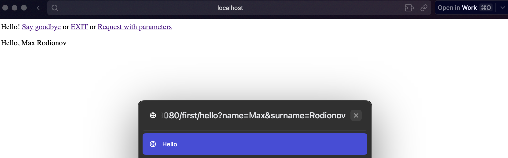
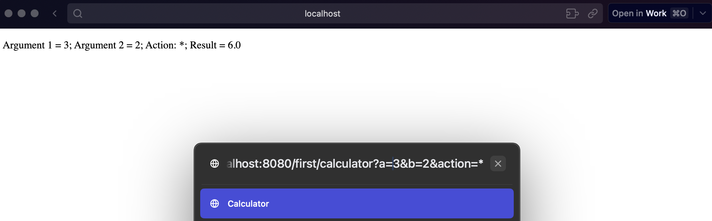
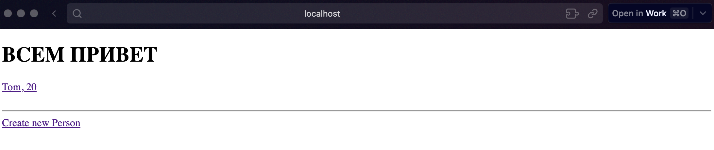
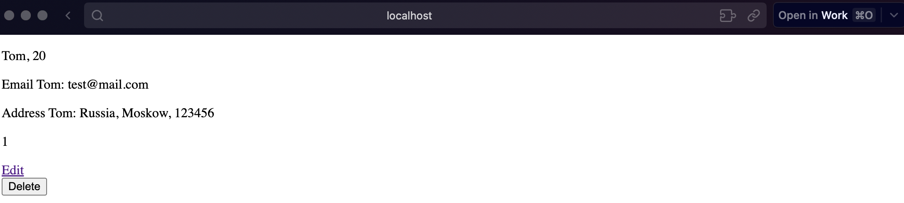
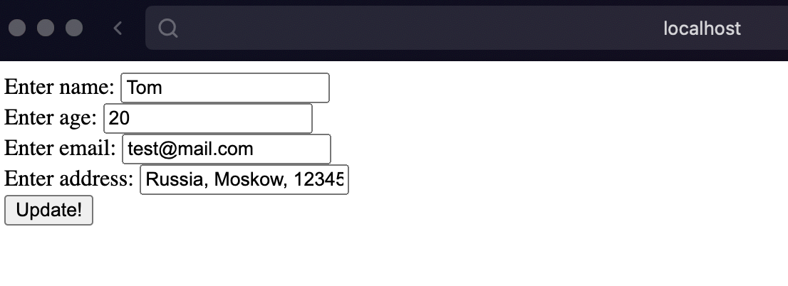
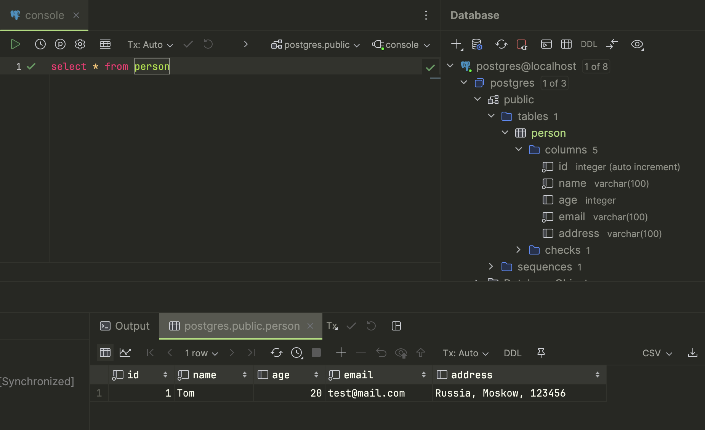

# Здесь хранится вся практика по Java

## Проекты учебные / личные по ссылке ниже
- <a href="https://github.com/general9k/java_projects"> *ТЫК* </a>

## Учебная практика:

#### - SpringMVC_calculator - калькулятор, который выводит результат выражения. Просит на вход a, b в get запросе. Поддерживает только команды +, -, *, /. Также можно ввести имя и фамилию в http выражении при /first/hello и выдаст на странице имя и фамилию, которую ввели.

- Ввели имя и фамилию, получили результат.

- Ввели a и b, получили результат.

#### - Hibernate_practice_PostgreSQL - практика с Hibernate и PostgreSQL, изучение связей один-ко-многим, один-к-одному, многие-ко-многим.

#### - CRUD_without_hibernate - CRUD приложение написанное на JDBC Template с использованием синтаксиса SQL. Создан человек с полями id, name, age, email, addres - все поля валидированы с помощью анатаций. Используются GET, POST, PATCH, DELETE запросы к базе данных PostrgeSQL. 

- На основной странице /people высвечиваются все люди, которые присутствуют в БД. Также имеется кнопка "create new person" которая создает пользователя и загружает в БД.

- Страница отображения одного человека. Высвечивается имя, возраст, почта, адресс и айди в БД - все данные берутся из БД с помощью SQL запросов. Присутствует кнопка EDIT и DELETE. Кнопка DELETE передает DELETE запрос к БД на удаление человека.

- Страница редактирования пользователя. Все поля изначально подгрузились из БД. Кнопка Update отправляет PATCH запрос к БД для изменения полей человека.

- Запрос к БД на наличие людей. Все верно, там был один человек.

